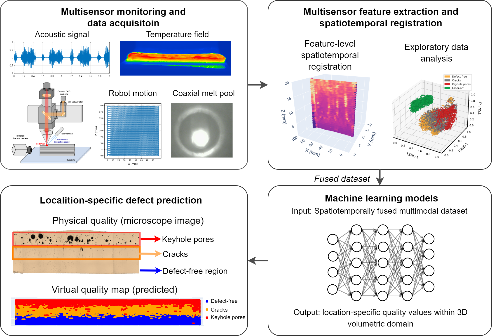
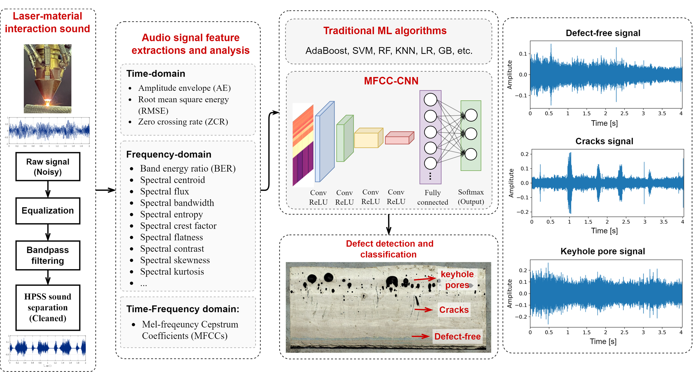

# MultiSensorFusion-ROS-AM-Monitoring


<div align="center">


[](LICENSE)


</div>

> ROS-based Multisensor Fusion Digital Twin (MFDT) platform for real-time monitoring and defect detection of Laser-Directed Energy Deposition (L-DED) Additive Manufacturing (AM) process.

📌 
This repository provides a comprehensive ROS-based framework for implementing multi-sensor monitoring, defect detection, advanced robotic manipulation in Laser Additive Manufacturing systems. It integrates thermal imaging, acoustic signal processing, and laser line scanning to enable real-time defect detection and quality inspection during Laser-Directed Energy Deposition processes. The system incorporates machine learning algorithms for in-situ monitoring and represents a Digital Twin approach to advanced manufacturing processes.

<div align="center">

</div>

## 📋 Table of Contents

- [Publications](#-publications)
- [Installation](#-installation)
- [Experiment Instructions](#-experiment-instructions)
  - [Hardware Configuration](#hardware-configuration-multisensor)
  - [Multimodal Monitoring](#1-multimodal-monitoring)
  - [Single Modal Monitoring](#2-single-modal-monitoring)
    - [Acoustic Monitoring](#21-acoustic-monitoring)
    - [Thermal Monitoring](#22-thermal-monitoring-infratec-variocam)
    - [Laser Line Scanning](#23-laser-line-scanning-microepsilon)
  - [Post-Experiment Data Processing](#3-post-experiment-offline-data-processing)
- [Status Indicators](#status-indicators)

## 📑 Publications

### Multisensor Fusion-Based Digital Twin for Localized Quality Prediction in Robotic Laser-Directed Energy Deposition
[](https://www.sciencedirect.com/science/article/pii/S0736584523000571) 
[](https://arxiv.org/abs/2305.13596)
[](https://www.youtube.com/watch?v=OSBqqam3sm4)

Chen, L., Bi, G., Yao, X., Tan, C., Su, J., Ng, N.P.H., Chew, Y., Liu, K. and Moon, S.K., 2023. Multisensor fusion-based digital twin for localized quality prediction in robotic laser-directed energy deposition. *Robotics and Computer-Integrated Manufacturing*, 84, p.102581.

<table width="100%">
  <tr>
    <td align="center" width="50%">
      <strong>Digital Twin for Multi-Sensor Fusion in LDED</strong><br>
      <a href="https://www.youtube.com/watch?v=OSBqqam3sm4">
        
        <br>
        
      </a>
    </td>
    <td align="center" width="50%">
      <strong>Infrared Thermal Monitoring of LDED Process</strong><br>
      <a href="https://www.youtube.com/watch?v=RdbRIBVC3CI">
        
        <br>
        
      </a>
    </td>
  </tr>
  <tr>
    <td align="center" width="50%">
      <strong>Melt Pool Vision-Acoustic Data Fusion for Real-Time Defect Detection</strong><br>
      <a href="https://www.youtube.com/watch?v=yQpQ-ty3PjQ">
        
        <br>
        
      </a>
    </td>
    <td align="center" width="50%">
      <strong>Multisensor Feature Visualization for In-Situ Monitoring</strong><br>
      <a href="https://www.youtube.com/watch?v=NEZGbJvMfGA">
        
        <br>
        
      </a>
    </td>
  </tr>
</table>

---

### Acoustic-Based Defect Detection in Laser-DED Through Deep Learning
[](https://www.sciencedirect.com/science/article/abs/pii/S2214860423001604)
[](https://arxiv.org/abs/2304.04598)

Chen, L., Yao, X., Tan, C., He, W., Su, J., Weng, F., Chew, Y., Ng, N.P.H. and Moon, S.K., 2023. In-situ crack and keyhole pore detection in laser directed energy deposition through acoustic signal and deep learning. *Additive Manufacturing*, 103547.

<div class="single-image-container">
    
    <p style="text-align: center; font-size: 0.9em; color: #666; margin-top: 8px;">
        In-situ defect detection in LDED through acoustic signal and deep learning.
    </p>
</div>

---

## 💻 Installation

### ROS and Ubuntu Setup
1. Install ROS-Noetic on Ubuntu 20.04:
   ```bash
   # Follow the instructions at:
   # http://wiki.ros.org/noetic/Installation/Ubuntu
   ```

### Developer Essentials
```bash
sudo apt-get install build-essential g++ python3-dev autotools-dev libicu-dev libbz2-dev libboost-all-dev intltool libglib2.0-dev
```

### OpenCV Installation
```bash
sudo apt install libopencv-dev python3-opencv
```

### GStreamer Installation
```bash
sudo apt-get install libgstreamer1.0-dev libgstreamer-plugins-base1.0-dev libgstreamer-plugins-bad1.0-dev gstreamer1.0-plugins-base gstreamer1.0-plugins-good gstreamer1.0-plugins-bad gstreamer1.0-plugins-ugly gstreamer1.0-libav gstreamer1.0-tools gstreamer1.0-x gstreamer1.0-alsa gstreamer1.0-gl gstreamer1.0-gtk3 gstreamer1.0-qt5 gstreamer1.0-pulseaudio
```

### ROS Packages Installation
```bash
sudo apt-get install ros-noetic-roscpp ros-noetic-std-msgs
sudo apt-get install ros-noetic-industrial-core
sudo apt-get install ros-noetic-moveit-visual-tools
```

### ROS Controller Installation
```bash
sudo apt-get install ros-noetic-ros-control ros-noetic-ros-controllers
```

### VTK Installation
```bash
sudo apt install python3-pip
python -m pip install vtk
```

### PlotJuggler Installation
```bash
sudo apt install ros-noetic-plotjuggler-ros
```

### Python Packages Installation
```bash
pip install -r requirements.txt
```

### Pylon Camera ROS Packages (Basler USB Camera Driver)
1. Clone the official repository (already inside the __camera_utils__ folder):
   ```bash
   git clone https://github.com/basler/pylon-ros-camera
   ```
2. Clone drag&bot public common messages:
   ```bash
   git clone https://github.com/dragandbot/dragandbot_common.git
   ```
3. Install ROS dependencies:
   ```bash
   sudo sh -c 'echo "yaml https://raw.githubusercontent.com/basler/pylon-ros-camera/master/pylon_camera/rosdep/pylon_sdk.yaml" > /etc/ros/rosdep/sources.list.d/30-pylon_camera.list' && sudo rosdep update && sudo rosdep install --from-paths . --ignore-src --rosdistro=$ROS_DISTRO -y
   ```

### LightGBM Installation
Follow the instructions at:
- https://lightgbm.readthedocs.io/en/stable/Installation-Guide.html#linux
- For Python LightGBM: https://blog.csdn.net/CSDNLHCC/article/details/135053162

### Micro-Epsilon ScanControl SDK Installation
Install from:
```
./src/microEpsilon_scanControl/microepsilon_scancontrol/scanCONTROLLinuxSDK0.2.3
```

### Aravis Installation
1. Download the aravis-0.6.1.tar.xz package (version 0.7 is not stable, do not download):
   - http://ftp.acc.umu.se/pub/GNOME/sources/aravis/0.6/
2. Install:
   ```bash
   ./configure
   sudo make
   sudo make install
   sudo ldconfig
   ```

If you encounter: "Error Message: checking for GTK... configure: error: Package requirements (gtk+-2.0 ¿= 2.10.0) were not met: No package 'gtk+-2.0' found":
```bash
sudo apt-get update && sudo apt-get upgrade
sudo apt-get install intltool
sudo apt-get install libgtk2.0-dev
```

### Essentia Installation
1. Download the master branch via Github Desktop:
   - https://github.com/MTG/essentia
2. Compile following the instructions provided in the repository

## 🔬 Experiment Instructions

### Hardware Configuration (Multisensor)

#### Connections (Ubuntu Linux Settings)

- **Xiris 1800V Thermal Camera** (melt pool monitoring): 
  - Connection: Ethernet port
  - Suggested IP on monitoring PC: (Refer to your hardware documentation)

- **Xiris WeldMIC Acoustic Monitoring**: 
  - Connection: USB port

- **KUKA RSI Interface**: 
  - Connection: Ethernet port
  - Suggested IP on monitoring PC: **192.168.1.3**

- **Coaxial CCD Melt Pool Camera**: 
  - Connection: USB port

- **Infratec Thermal Camera**: 
  - Connection: PCI Ethernet port
  - Suggested IP on monitoring PC: **169.254.87.1**

- **ABB**: 
  - Connection: Ethernet port
  - Suggested IP on monitoring PC: **192.168.125.3**

### 1. Multimodal Monitoring

#### 1.1 Software Instructions

- Launch monitoring (without experiments):
  ```bash
  roslaunch multimodal_monitoring multimodal_monitoring.launch
  ```

- Launch monitoring for experiments (with rosbag recording):
  ```bash
  roslaunch multimodal_monitoring multimodal_monitoring_experiments.launch
  ```

#### 1.2 Configurations

- To enable thermal monitoring, set parameter:
  ```xml
  <arg name="thermal" default="true"/>
  ```
- To enable acoustic monitoring, set parameter:
  ```xml
  <arg name="acoustic" default="true"/>
  ```
- Change the path of recorded audio signal (wav):
  ```xml
  <arg name="dst" default="~/SIMTech_ws/src/acoustic_monitoring/data/KUKA_printing_SS_recording_6.wav"/>
  ```
- **Record** data into **rosbag** (located in the **multimodal_monitoring_experiments.launch** file):
  ```xml
  <node pkg="rosbag" type="record" name="rosbag_record_multimodal monitoring_experiment" 
  args="-O ~/SIMTech_ws/src/acoustic_monitoring/data/KUKA_printing_SS_recording_6.bag 
  /audio /audioStamped /acoustic_feature" />
  ```

#### 1.3 Important Instructions for Conducting Experiments

- Before experiments, fine-tune the thermal camera's focus to the laser spot
- Configure the temperature range of the camera (500-2000 degrees) — **only for Infratec VarioCAM camera, not needed for Xiris**
- ⚠️ Conduct a dry run to test the microphone sensor to ensure it's capturing the acoustic signal correctly
- For KUKA program, add RSI communications in the code

**Network Connection Tests:**

- Ping KUKA LDED robot RSI interface:
  ```bash
  ping 192.168.1.3
  ```
- Ping MicroEpsilon ScanController:
  ```bash
  ping 169.254.87.67
  ```
- Ping ABB driver:
  ```bash
  ping 192.168.125.1
  ```

#### 1.4 Data Recordings

- General format (without robot):
  ```bash
  rosbag record -O /media/chenlequn/Lequn_HD/Research_Projects/multimodal_monitoring/data/experiment.bag /audio /audioStamped /acoustic_feature /infratec/image_raw /infratec/image_converted_mono8 /infratec/temperature_feature /general_contours/max_contour_area /convex_hull/hull_area
  ```

- Record all information:
  ```bash
  rosbag record -O /media/chenlequn/Lequn_HD/Research_Projects/multimodal_monitoring/data/experiment.bag /audio /audioStamped /acoustic_feature /infratec/image_raw /infratec/image_converted_mono8 /infratec/temperature_feature /general_contours/max_contour_area /convex_hull/hull_area /cartesian_position /cartesian_velocity
  ```

- List all available topics:
  ```bash
  rostopic list
  ```

- ⚠️ Remember to change the name of the bag file and its location for each experiment

### 2. Single Modal Monitoring

### 2.1. Acoustic Monitoring

#### 2.1.1 Parameters and Setup

- Device selection:
  ```bash
  arecord -l  # Shows available input devices
  ```
  Use the card number and subdevice number in format `hw:1,0`:
  ```xml
  <arg name="device" default="hw:2,0" />
  ```

- Set sampling rate:
  ```xml
  <arg name="sample_rate" default="44100"/>
  ```

#### 2.1.2 Launch Instructions

- Standalone acoustic monitoring:
  ```bash
  roslaunch acoustic_feature_extraction acoustic_monitoring.launch
  ```

- Acoustic monitoring with rosbag recording:
  ```bash
  roslaunch acoustic_feature_extraction acoustic_monitoring_experiment.launch
  ```

### 2.2. Thermal Monitoring (Infratec VarioCAM)

#### 2.2.1 Configuration and Specifications

- Set parameters for thermal images (max/min temp, croppings):
  ```
  ~/SIMTech_ws/src/Infratec_thermal_camera/thermal_monitoring/config/thermal_camera_parameter.yaml
  ```
  ⚠️⚠️⚠️ Note: Changes to this YAML file will **overwrite** the default settings

- Set Python with network access:
  ```bash
  setcap cap_net_raw+eip /usr/bin/python3.6
  ```

#### 2.2.2 Launch Instructions

- Launch basic thermal camera driver GUI (for testing Infratec camera):
  ```bash
  roslaunch infratec_ros_driver infratec_vario_ros_driver_basic.launch
  ```

- Launch thermal camera driver GUI with thermal image conversions:
  ```bash
  roslaunch infratec_ros_driver infratec_driver_image_convert.launch
  ```

- **Thermal Camera Monitoring Basic**: Camera + KUKA robot connection:
  ```bash
  roslaunch thermal_monitoring thermal_monitoring_basic.launch
  ```

- **Thermal Camera Monitoring**: Camera + robot + in-situ image processing:
  ```bash
  roslaunch thermal_monitoring thermal_monitoring.launch
  ```
  Note: Open the launch file and set corresponding nodes to **false** if not needed

- **Thermal Camera Monitoring with Multimodal GUI** (under development):
  ```bash
  roslaunch infratec_ros_driver qt_infratec_insitu_monitoring.launch
  ```

### 2.3. Laser Line Scanning (MicroEpsilon)

#### 2.3.1 Configuration and Specifications

```bash
ping 192.168.1.3    # KUKA RSI
ping 169.254.87.67  # MicroEpsilon
```

#### 2.3.2 Launch Instructions

```bash
cd ~/SIMTech_ws/src/scanning_application/scanning_robviz/launch
roslaunch scanning_robviz robviz_abb_microepsilon.launch  # for ABB hybrid laser-arc
roslaunch scanning_robviz robviz_kuka_microepsilon.launch  # for KUKA system
```

### 3. Post-Experiment Offline Data Processing

- Navigate to `experiment_data` folder
- Execute feature extraction for thermal monitoring:
  ```bash
  roslaunch experiment_data feature_extraction.launch
  ```

## Status Indicators

| Symbol | Meaning |
|--------|---------|
| ❗ | Important instructions |
| ❓ | Unsolved issues (to be developed in the future) |
| 🔴 | Code finished but not tested |
| ❌ | Code under heavy development |
| ⬜ | Dead end and archived |
| ✅ | Tested successfully |

---

<div align="center">

**MFDT Workspace** © 2023

</div>