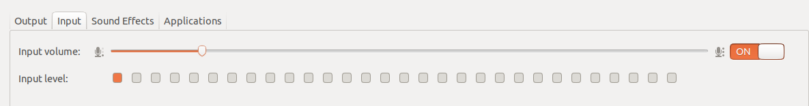

# Acoustic Signal Processings

## Some important settings

### Set the correct microphone device in the launch file
- list all the microphone device in linux
```
arecord -l
```
- specify the device in the launch file (multiodal_monitoring and capture.launch, etc.)
arecord -l will show available input devices, use the car number as the first number and the subdevice number as the second in a string like hw:1,0
```
<arg name="device" default="hw:1,0" />
```


### Set the microphone volume 
- Depends on how far you put the microphone from the source
- A default setting from the previous experiment: 
__between five and six box__


<!--  -->